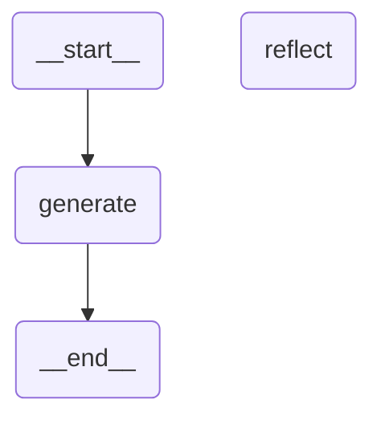

```mermaid

graph TD;
        __start__(<p>__start__</p>)
        generate(generate)
        reflect(reflect)
        __end__(<p>__end__</p>)
        __start__ --> generate;
        generate --> __end__;
        classDef default fill:#f2f0ff,line-height:1.2
        classDef first fill-opacity:0
        classDef last fill:#bfb6fc
```