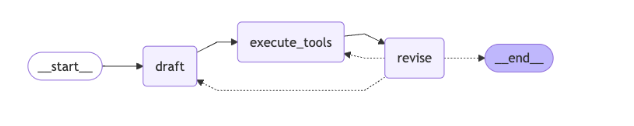

# Document d'apprentissage Français-Anglais : Agent de Réflexion avec LangGraph

## Dépôt GitHub pour l'Agent de Réflexion
Ce projet implémente un Agent de Réflexion utilisant LangChain et LangGraph. L'agent est conçu pour générer et affiner des tweets en utilisant un processus itératif d'auto-évaluation et d'amélioration.

## GitHub Repository for Reflexion Agent
*This project implements a Reflexion Agent using LangChain and LangGraph. The agent is designed to generate and refine tweets using an iterative process of self-evaluation and improvement.*

---

## Chronologie de développement
La structure de ce dépôt GitHub suit l'organisation des cours sur les agents de réflexion, démontrant les concepts clés dans la construction d'un Agent de Réflexion.

## Development Timeline
*The structure of this GitHub repository follows the organization of the courses on reflection agents, demonstrating the key concepts in building a Reflexion Agent.*

---

### 1. Mise en place de la structure initiale du projet
*Correspond au cours : 00 Configuration du projet*

Cette étape établit les fondations avec les fichiers de configuration essentiels :
- `.gitignore` pour exclure certains fichiers du suivi Git
- `main.py` comme point d'entrée de l'application
- `pyproject.toml` pour la gestion des dépendances et la configuration du projet
- `poetry.lock` pour verrouiller les versions des dépendances

### 1. Add initial project structure
*Corresponds to Lecture : 00 Project Setup*

*This step establishes the foundation with essential configuration files:*
- `.gitignore` *to exclude certain files from Git tracking*
- `main.py` *as the application entry point*
- `pyproject.toml` *for dependency management and project configuration*
- `poetry.lock` *to lock dependency versions*

---

### 2. Création des chaînes pour la fonctionnalité de génération
*Correspond au cours 18 : Agent Acteur (Actor Agent)*

À cette étape, nous implémentons le premier composant de notre architecture d'agent - l'Acteur :
- Ajout de `chains.py` avec des modèles de prompts (templates) pour générer des tweets
- Configuration des schémas avec des modèles Pydantic pour la gestion structurée des données

### 2. Create chains for AI-powered research functionality
*Corresponds to Lecture 18: Actor Agent*

*At this stage, we implement the first component of our agent architecture - the Actor:*
- *Addition of `chains.py` with prompt templates for generating tweets*
- *Configuration of schemas with Pydantic models for structured data handling*

---

### 3. Amélioration des chaînes pour les capacités de révision
*Correspond au cours 19 : Agent Réviseur (Revisor Agent)*

Nous implémentons ici le deuxième composant - le Réviseur pour l'auto-réflexion :
- Ajout de la classe `ReviseAnswer` dans `schemas.py` pour une structure de réponse améliorée
- Mise à jour des prompts de chaîne pour intégrer des critiques et des exigences d'amélioration

### 3. Enhance chains for answer revision capabilities
*Corresponds to Lecture 19: Revisor Agent*

*Here we implement the second component - the Revisor for self-reflection:*
- *Addition of the `ReviseAnswer` class in `schemas.py` for an improved response structure*
- *Update of chain prompts to incorporate critique and improvement requirements*

---

### 4. Ajout de dépendances et d'outils pour les nœuds du graphe
*Correspond au cours 20 : Nœud d'Outil (ToolNode) - Exécution d'outils*

Cette phase intègre des fonctionnalités supplémentaires pour améliorer la précision des réponses :
- Intégration de fonctionnalités de recherche pour enrichir la génération de contenu
- Ajout des dépendances requises pour le flux de travail complet du graphe

### 4. Add dependencies and tools for graph nodes
*Corresponds to Lecture 20: ToolNode - Executing Tools*

*This phase integrates additional functionalities to improve response accuracy:*
- *Integration of search functionality to enrich content generation*
- *Addition of required dependencies for the complete graph workflow*

---

### 5. Implémentation du graphe de messages complet
*Correspond au cours 21 : Construction de notre Graphe LangGraph*

Nous connectons ici les agents Acteur et Réviseur dans un flux de travail LangGraph complet :
- Définition des nœuds de graphe pour la rédaction, l'exécution d'outils et la révision
- Établissement de la gestion d'état et du routage conditionnel pour la réflexion
- Configuration du flux de traitement itératif pour l'amélioration continue des tweets

### 5. Implement the complete message graph
*Corresponds to Lecture 21: Building our LangGraph Graph*

*Here we connect the Actor and Revisor agents in a complete LangGraph workflow:*
- *Definition of graph nodes for drafting, tool execution, and revision*
- *Establishment of state management and conditional edge routing for reflection*
- *Configuration of the iterative processing flow for continuous tweet improvement*

---

## Architecture technique
L'agent est construit autour de deux chaînes LangChain principales :
1. **Chaîne de génération** : crée des tweets basés sur les demandes de l'utilisateur
2. **Chaîne de réflexion** : évalue les tweets générés et fournit des critiques constructives

Ces chaînes sont ensuite orchestrées dans un graphe LangGraph qui permet un processus itératif d'amélioration du contenu.

## Technical Architecture
*The agent is built around two main LangChain chains:*
1. **Generation chain**: *creates tweets based on user requests*
2. **Reflection chain**: *evaluates generated tweets and provides constructive criticism*

*These chains are then orchestrated in a LangGraph graph that enables an iterative process of content improvement.*

---

## Flux de travail
1. L'utilisateur fournit une demande initiale de génération ou d'amélioration de tweet
2. Le nœud de génération crée un tweet initial
3. Le nœud de réflexion évalue ce tweet et formule des recommandations d'amélioration
4. Le nœud de génération utilise ces recommandations pour améliorer le tweet
5. Ce cycle se répète jusqu'à ce qu'une condition d'arrêt soit atteinte (dans l'exemple, après un certain nombre d'itérations)

## Workflow
*1. The user provides an initial request for tweet generation or improvement*
*2. The generation node creates an initial tweet*
*3. The reflection node evaluates this tweet and formulates improvement recommendations*
*4. The generation node uses these recommendations to improve the tweet*
*5. This cycle repeats until a stop condition is reached (in the example, after a certain number of iterations)*

---

## Composants clés
- **MessageGraph** (Graphe de messages) : structure qui organise le flux de traitement
- **Nœuds** : fonctions qui exécutent des tâches spécifiques (génération, réflexion)
- **Arêtes conditionnelles** : logique qui détermine le chemin à suivre dans le graphe
- **Chaînes LangChain** : séquences d'opérations avec des modèles de langage

## Key Components
- **MessageGraph**: *structure that organizes the processing flow*
- **Nodes**: *functions that execute specific tasks (generation, reflection)*
- **Conditional Edges**: *logic that determines the path to follow in the graph*
- **LangChain Chains**: *sequences of operations with language models*

---

## Lexique technique

| Français | Anglais |
|----------|---------|
| Agent de Réflexion | Reflexion Agent |
| Chaîne de génération | Generation chain |
| Chaîne de réflexion | Reflection chain |
| Graphe de messages | Message graph |
| Nœud de génération | Generation node |
| Nœud de réflexion | Reflection node |
| Arête conditionnelle | Conditional edge |
| Point d'entrée | Entry point |
| Modèle de langage | Language model (LM) |
| Modèles de prompts | Prompt templates |
| Agent Acteur | Actor Agent |
| Agent Réviseur | Revisor Agent |
| Nœud d'Outil | Tool Node |
| Flux de travail | Workflow |
| Gestion d'état | State management |
| Routage conditionnel | Conditional routing |