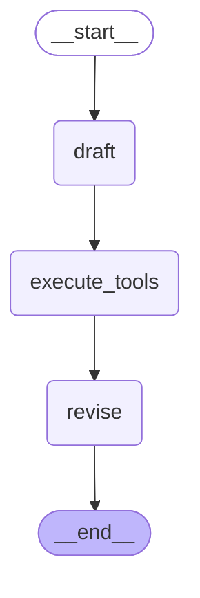

```mermaid
graph TD;
        __start__([<p>__start__</p>]):::first
        draft(draft)
        execute_tools(execute_tools)
        revise(revise)
        __end__([<p>__end__</p>]):::last
        __start__ --> draft;
        draft --> execute_tools;
        execute_tools --> revise;
        revise --> __end__;
        classDef default fill:#f2f0ff,line-height:1.2
        classDef first fill-opacity:0
        classDef last fill:#bfb6fc

```