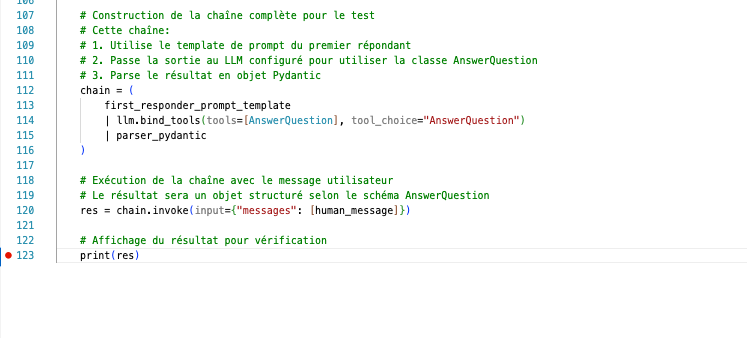

# Guide du débogage dans VS Code pour développeurs juniors

Je vais vous expliquer les concepts clés du débogage dans VS Code en analysant votre code LangChain et la capture d'écran du débogueur que vous avez partagée.

## 1. Principes fondamentaux du débogueur VS Code

### Points d'arrêt (Breakpoints)
Vous avez correctement placé un point d'arrêt à la ligne 123 (`print(res)`). Lorsque l'exécution atteint cette ligne, VS Code suspend le programme et vous permet d'examiner l'état actuel.




### Fenêtre Variables
La fenêtre Variables est la section la plus importante à observer dans votre capture d'écran. Elle affiche:
- **Locals**: Variables disponibles dans la portée locale actuelle
- **Globals**: Variables disponibles dans la portée globale


### Structure de la fenêtre Variables
Dans votre capture d'écran, nous pouvons voir:
- Les variables sont organisées hiérarchiquement avec des triangles d'expansion (►)
- Des types de variables spécifiques sont regroupés (special variables, function variables, class variables)

## 2. Analyse de votre code LangChain dans le débogueur

### Variables clés à observer

1. **`res`**: C'est votre variable la plus importante puisqu'elle contient le résultat de votre chaîne LangChain. Dans le débogueur, je vois:
   ```python
   res = [AnswerQuestion(answer="The AI-Powered SOC (Security Operations Center) and Autonomous...security operations automation start-ups")]
   ```
   Ceci montre que `res` est une liste contenant un objet `AnswerQuestion` avec une réponse structurée.

2. **`chain`**: Représente votre chaîne LangChain complète (template → LLM → parser)

3. **`human_message`**: Contient la requête utilisateur que vous testez

4. **`llm`**: Instance de votre modèle de langage OpenAI

5. **`parser_pydantic`**: Le parseur qui transforme la sortie JSON en objet Pydantic

## 3. Techniques avancées de débogage pour LangChain

### Inspection des objets complexes
Les objets LangChain comme `first_responder` et `chain` sont complexes. Pour les examiner:
1. Développez-les dans la fenêtre Variables
2. Recherchez les attributs clés comme `input_types` et `input_variables`

### Surveillance des transformations de données
Votre code effectue plusieurs transformations:
1. Message utilisateur → Prompt structuré
2. Prompt → Réponse LLM
3. Réponse LLM → Structure Pydantic

Pour comprendre ces transformations, vous pourriez ajouter des points d'arrêt intermédiaires.

## 4. Astuces pratiques de débogage dans VS Code

### Navigation pas à pas
VS Code offre plusieurs options pour naviguer dans le code pendant le débogage:
- **Step Over** (F10): Exécute la ligne actuelle et s'arrête à la suivante
- **Step Into** (F11): Entre dans une fonction appelée
- **Step Out** (Shift+F11): Sort de la fonction actuelle
- **Continue** (F5): Continue l'exécution jusqu'au prochain point d'arrêt

### Watch Expressions
Vous pouvez ajouter des expressions à surveiller pour suivre des valeurs spécifiques:
1. Cliquez sur le panneau "Watch"
2. Ajoutez des expressions comme `res[0].answer` pour voir la réponse formatée

### Évaluation dans le débogueur
Dans la console de débogage, vous pouvez exécuter du code Python pour tester des expressions:
```python
# Par exemple, pour voir uniquement la réponse
print(res[0].answer)

# Ou pour examiner la structure de l'objet
import json
print(json.dumps(res[0].dict(), indent=2))
```

## 5. Points d'intérêt spécifiques dans votre code

Dans votre débogage, ces éléments méritent une attention particulière:

1. **Structure de l'objet `AnswerQuestion`**
   - Développez `res` pour voir tous les champs de l'objet (probablement `answer`, `critique`, et `search_queries`)

2. **Configuration du LLM**
   - Examinez `llm` pour vérifier les paramètres comme le modèle et la température

3. **Templates de prompt**
   - Consultez `first_responder_prompt_template` pour voir comment le prompt est structuré

## 6. Résolution de problèmes courants

Si vous rencontrez des erreurs dans votre chaîne LangChain:

1. **Erreurs de parsing**
   - Vérifiez `parser_pydantic` et la structure de votre schéma Pydantic

2. **Problèmes de communication avec l'API**
   - Inspectez `llm` pour confirmer que les identifiants d'API sont chargés

3. **Erreurs de structure de prompt**
   - Examinez les valeurs de `input_variables` pour vérifier que tous les placeholders sont remplis

## Conclusion

Le débogueur VS Code est un outil puissant pour comprendre le flux d'exécution et l'état des variables dans votre code. Pour les applications LangChain, il est particulièrement utile pour inspecter les transformations de données et la structure des réponses du LLM.

Pour approfondir vos compétences en débogage, essayez d'ajouter des points d'arrêt à différentes étapes de votre chaîne et explorez les valeurs intermédiaires pour comprendre comment les données circulent dans votre application.